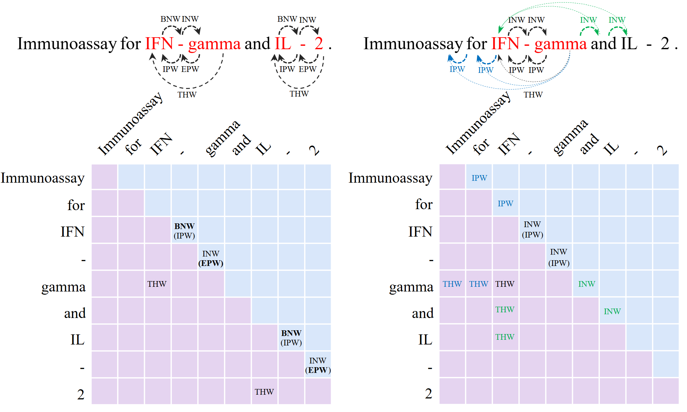

# Few-shot Biomedical NER via Multi-task Learning and More Fine-grained Grid-tagging Strategy(MMG)
 

### 1_aug_exam
<p align="center">
  
</p>
 

### 2_decode
<p align="center">
  
</p>


### 2_model
<p align="center">
  
</p>

## 1. Environments

```
- python (3.8.12)
- cuda (11.4)
```

## 2. Dependencies

```
- numpy (1.21.4)
- torch (1.10.0)
- gensim (4.1.2)
- transformers (4.13.0)
- pandas (1.3.4)
- scikit-learn (1.0.1)
- prettytable (2.4.0)
```

## 3. Dataset

We provide some datasets processed in our code.

## 4. Training

```bash
>> python main-run-start-end-mul-out-1-new-decoding.py --config ./config/BC5CDR.json --shot 5-1 --learning_rate 0.003 --epochs 20 --loss2_weight '0.2' --loss3_weight '0.2'
```


